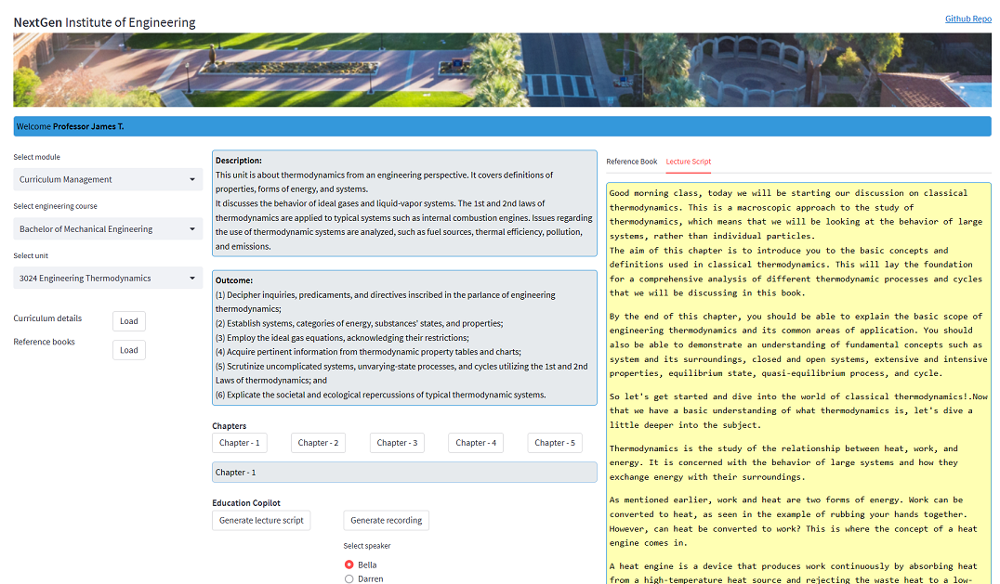

# Azure OpenAI Lecture Generation Demo



## About

This is an example of how Azure OpenAI and Azure Cognitive Services text-to-speech technology can be utilized to create recorded lectures based on information from textbooks.

## How to deploy

**Run locally from Visual Studio Code or command prompt**
- Open VS Code terminal or command prompt.
- Clone this repository and open in VS Code.
- Create a new conda environment
    - ```conda create -n openaidemo_py39 python=3.9 anaconda```
    - ```conda activate openaidemo_py39```
    - For more info go to [Conda documentation](https://conda.io/projects/conda/en/latest/user-guide/tasks/manage-python.html) 
- Navigate to _misc_ directory and run 
    - ```pip install -r requirements.txt```
- Provision Azure OpenAI service
    - Under deployments within Azure OpenAI Studio, deploy gpt-35-turbo model. Note name of deployment.    
    - Model availability varies by region in which OpenAI service is provisioned in Azure.
    - For more info go to [Create a resource and deploy a model using Azure OpenAI](https://learn.microsoft.com/en-us/azure/cognitive-services/openai/how-to/create-resource)
- Provision Azure Cognitive Services
    - Create Cognitive Services multi-service resource.    
    - For more info go to [Create a new Azure Cognitive Services resource](https://learn.microsoft.com/en-us/azure/cognitive-services/cognitive-services-apis-create-account?tabs=multiservice%2Canomaly-detector%2Clanguage-service%2Ccomputer-vision%2Cwindows#create-a-new-azure-cognitive-services-resource)
- Open _modules/utilities.py_ file and scroll to very bottom
    - Update value for "deployment_name" tag for parent tag "gpt-35-turbo". This name you noted in steps above.   
- Almost there, rename _.env_template_ file to _.env_ 
    - Renamed file should be placed  within same directory as this readme.md file. 
    - Replace placeholders with correct values.    
- Navigate to _/app_ directory and run following command from VS Code terminal. This will open the App UI in a browser window.
    - ```streamlit run app.py```